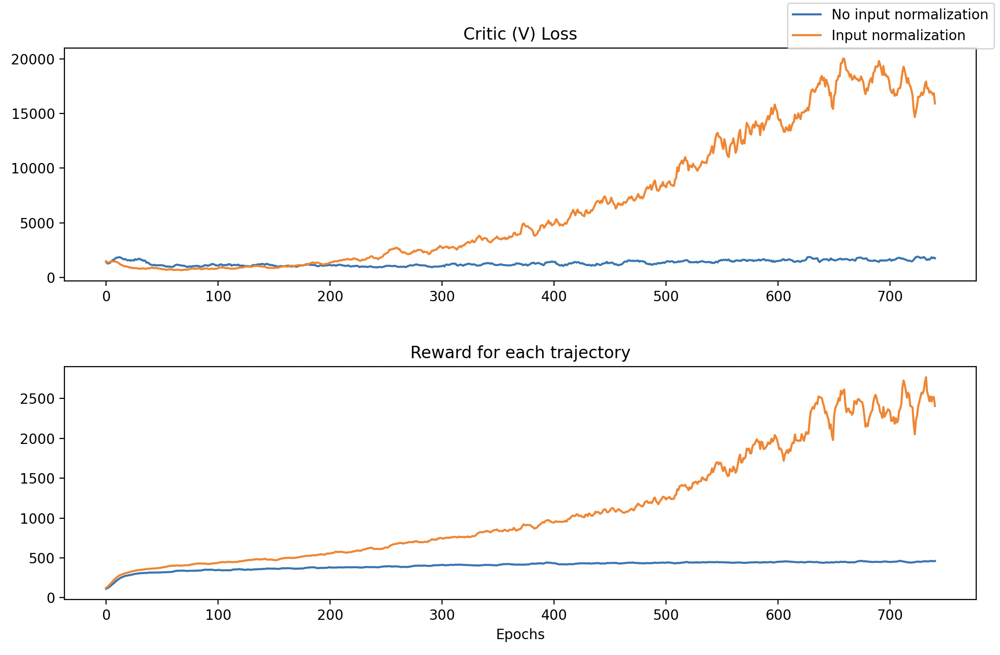
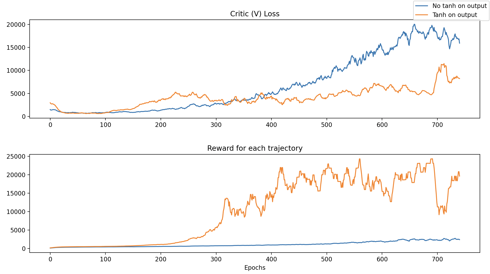
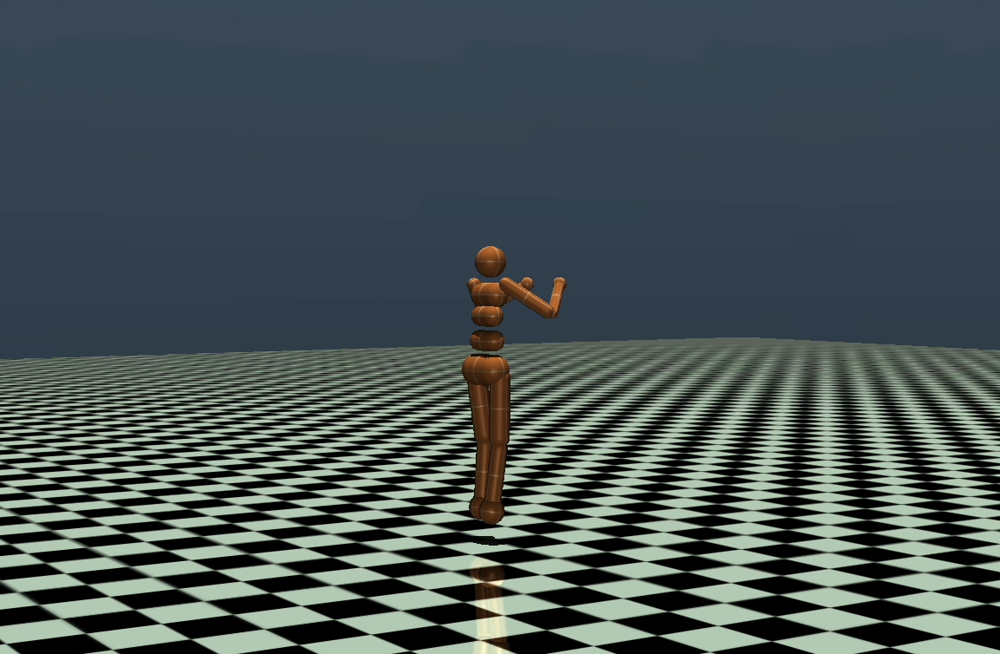

# Robot Learning Gym
This is a collection of machine learning models that I have implemented and trained on a range of robotic environments.
My focus is on humanoid robotics, and as such many of the enviornments will involve some form of bipedal robot, though
many other environments may be included to validate certain models.

### Algorithms Implemented
- Proximal Policy Optimization (PPO)
- Soft Actor Critic (SAC) -- IN PROGRESS
---
### Environments
- Gymnasium Environments (mainly to validate)
    - Humanoid
    -  Ant
    -  Arm
-  Humanoid Box-Tray
    - A modified version of Humanoid, in which a tray is rigidly attached to the arms of the humanoid, with a
      free box placed on top. The goal is for the agent to balance the box on the tray while walking forwards.

## Results
#### Humanoid
Demonstration of a typical trajectory after training:
| 
 Rollout 
 | 
  Input Normalization 
 |  
 Action Clipping 
 |
|--- | --- | --- |
|  |  |  |

<!-- 

Roll out of Trajectory

 Reward and loss during training
Reward and loss plots during training:

 -->